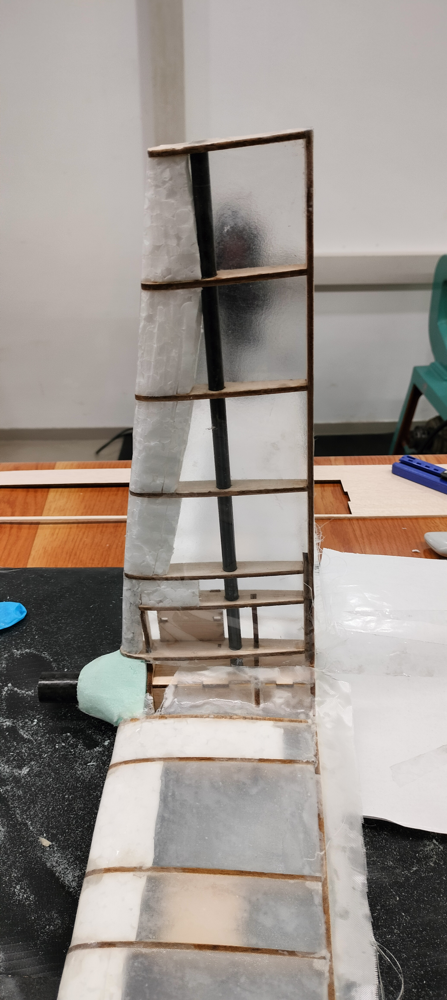
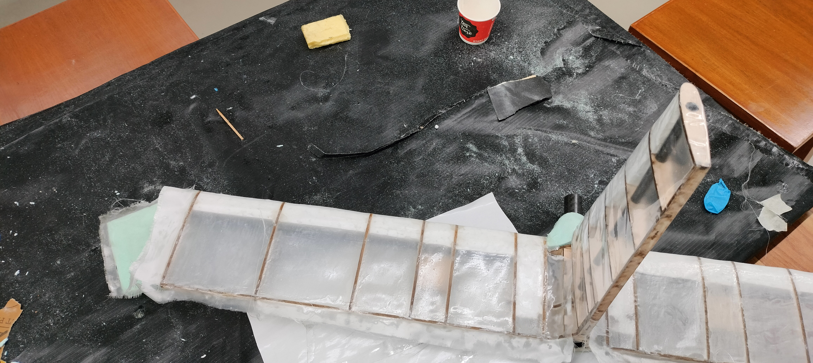
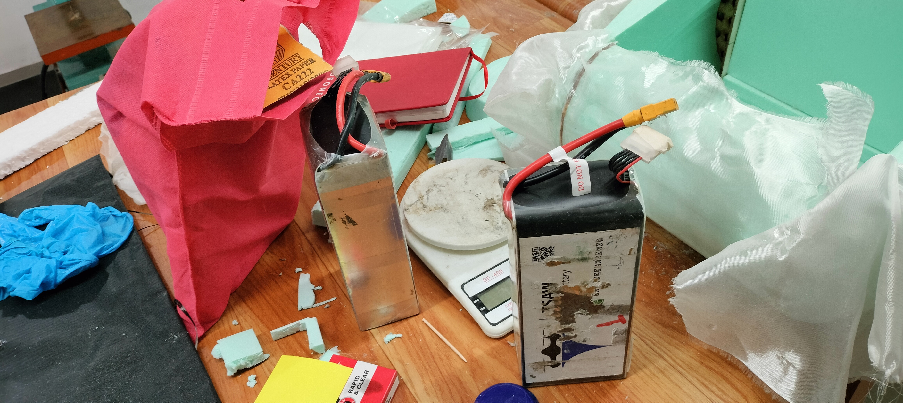

# Composite Fabrication

## Overview

Hands-on work related to composite fabrication for UAV structures,
with emphasis on carbon-fiber and glass-fiber reinforcement,
epoxy-resin processing, hand lay-up, and vacuum-bagging techniques.

## Objective

To study and implement suitable composite lay-up and fabrication
techniques for different XPS-based UAV geometries and specimens.

## Materials

- Carbon-fiber fabric
- Glass-fiber fabric
- Epoxy resin
- XPS-based geometries/specimens

## Fabrication Methods

### Hand Lay-up

Initial composite specimens were fabricated using the conventional
hand lay-up technique to understand fiber layering, resin application,
and laminate preparation.

### Vacuum Bagging

Vacuum bagging was subsequently implemented to improve laminate
consolidation and surface finish.

The process involved:

1. Preparing the specimen geometry
2. Cutting and arranging the reinforcement
3. Applying epoxy resin
4. Performing the required fiber lay-up
5. Preparing the vacuum-bagging stack
6. Applying vacuum for consolidation
7. Curing the laminate
8. Demoulding and inspecting the fabricated specimen

## Fabrication Work

Multiple carbon-fiber and glass-fiber specimens were fabricated over
different XPS-based geometries. Successive fabrication trials were
used to identify practical issues and improve the lay-up and
vacuum-bagging process.

## Key Learning

- Composite fiber orientation and layering
- Epoxy-resin processing
- Hand lay-up technique
- Vacuum-bagging procedure
- Laminate consolidation
- Specimen preparation and finishing
- Practical considerations in UAV composite fabrication

## Tools and Techniques

**Materials:** Carbon Fiber, Glass Fiber, Epoxy Resin, XPS

**Manufacturing:** Hand Lay-up, Vacuum Bagging

**Application:** UAV Structural Fabrication

---

## Supporting Documentation

Selected photographs of notes and documentation recorded during the
composite fabrication work.

### Fabrication Notes

